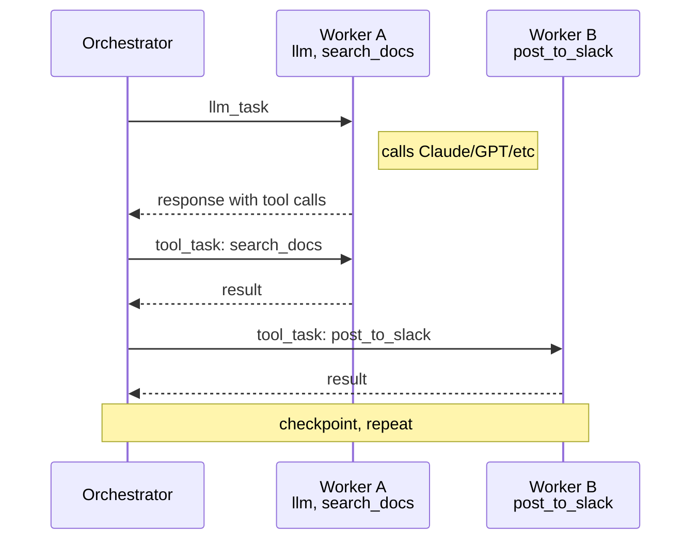

<p align="center">
  
</p>

<h1 align="center">Norns</h1>

<p align="center">
  <a href="https://github.com/nornscode/norns/actions/workflows/ci.yml"></a>
  <a href="LICENSE"></a>
  <a href="https://elixir-lang.org/"></a>
</p>

<p align="center">Kill the worker. The run picks up where it left off.</p>

https://github.com/user-attachments/assets/b300b164-dc0c-44ea-a794-1de00b4f01a7

<p align="center"><sub>An agent calls <code>wait</code> (10s), then <code>say_hello</code>. I kill the worker twice mid-run. Each time a new worker connects, the run picks up where it left off. Nothing is lost and nothing runs twice.</sub></p>

Norns is a durable execution runtime for AI agents, built in Elixir on the BEAM. Every LLM call, tool call, and tool result is an event in a Postgres log, and any connected worker can replay that log and carry the run forward.

- **A deploy or an eviction doesn't kill the run.** If the worker dies eight tool calls into a job, the next worker replays the event log and continues from the last completed step.
- **Resuming never sends the same email twice.** Side-effecting tools get a deterministic idempotency key, so a tool that already ran is skipped on replay.
- **Your API keys stay on your worker.** Norns dispatches tasks and records results; it never holds provider credentials and never calls a model or a tool itself.
- **You keep the model and the language you already use.** The wire format is provider-neutral, and there are Python and Elixir SDKs.

## Get started

```bash
brew install nornscode/tap/nornsctl
nornsctl dev
nornsctl new my-agent
cd my-agent
uv sync
uv run my-agent-worker
```

That gives you a Norns server and a worker connected to it. The [hello agent](https://github.com/nornscode/norns-hello-agent) walks through the rest.

## Why

On your laptop, durability is mostly a solved problem. The process stays up, the disk is reliable, and the transcript is right there. In the cloud, none of that holds. Containers get evicted, VMs get preempted, and every deploy kills whatever was in flight. An agent eight tool calls into a job can lose its whole environment at any moment, with no long-lived process or file system to fall back on.

Norns is built for the second case. The run's state lives in Postgres instead of the container, so losing the container costs you nothing.

## How it works

Postgres is the only thing you run besides Norns. Background jobs go through Oban on the same database, and there is no Redis or message broker.

The orchestrator is a state machine. It never calls an LLM and never runs a tool. It manages state transitions and persists events. Workers do the actual work.



Workers connect over WebSocket, register their tools, and hold the API keys. There's usually more than one. Each worker brings its own set of tools (a Slack worker, a database worker, one that wraps your internal API), and the agent sees the union of everything connected. The orchestrator routes each tool call to a worker that registered that tool. If no worker is connected, tasks queue until one shows up. If a worker dies mid-task, the orchestrator notices and puts the task back in the queue.

Side-effecting tools get a deterministic idempotency key derived from the run ID, step number, and tool call ID. On replay, if a result already exists for that key, the tool is skipped. That's what keeps a resumed run from sending the same email twice.

Errors get classified, because retrying everything is as wrong as retrying nothing:

- Transient failures (timeouts, worker disconnects, upstream outages) get a few retries with exponential backoff.
- Rate limits get patient retries with linear backoff. The dependency is fine, you just have to wait.
- Validation and policy errors are terminal. Retrying won't fix a bad input.

## SDKs and examples

- [Python SDK](https://github.com/nornscode/norns-sdk-python) — `pip install norns-sdk` ([PyPI](https://pypi.org/project/norns-sdk/))
- [Elixir SDK](https://github.com/nornscode/norns-sdk-elixir) — `{:norns_sdk, "~> 0.1"}` ([Hex](https://hex.pm/packages/norns_sdk))
- [CLI (`nornsctl`)](https://github.com/nornscode/nornsctl)
- [Hello example](https://github.com/nornscode/norns-hello-agent)
- [Mimir (full example app)](https://github.com/nornscode/norns-mimir-agent)

### Worker

```python
from norns import Norns, Agent, tool

@tool
def search_docs(query: str) -> str:
    return "..."

agent = Agent(
    name="support-bot",
    model="claude-sonnet-5",
    system_prompt="You are a support assistant.",
    tools=[search_docs],
)

norns = Norns("http://localhost:4000", api_key="nrn_...")
norns.run(agent)
```

### Client

```python
from norns import NornsClient

client = NornsClient("http://localhost:4000", api_key="nrn_...")
result = client.send_message("support-bot", "Where is my order?", wait=True)
print(result.output)
```

## Where this is going

Right now, making a new agent means writing a worker and deploying it. I want to get to the point where most agents don't need that. Workers like a Slack worker or a database worker are the parts that actually need to be deployed and kept running. Once they exist, an agent is just a row in the database: a prompt, a model, which tools it can call, and when it runs. You'd create one with an API call and it would start running against the workers already connected.

v0.5 got most of the pieces in place. Agents pick their own tools, cron triggers and inbound webhooks start runs, [gards](docs/gards.md) pin an agent to a particular worker, and `nornsctl new` scaffolds a project. The missing piece is something to keep the workers themselves running, so that's what I'm working on next. The longer version is in [docs/roadmap.md](docs/roadmap.md) and [docs/plan-agent-builder.md](docs/plan-agent-builder.md).

## Status

Norns is v0.x. I run [Mimir](https://github.com/nornscode/norns-mimir-agent) on it in production and it holds up, but the APIs are still moving. Breaking changes get called out in release notes, so pin versions. Hit a bug or some jank? [Open an issue](https://github.com/nornscode/norns/issues).

## License

MIT
