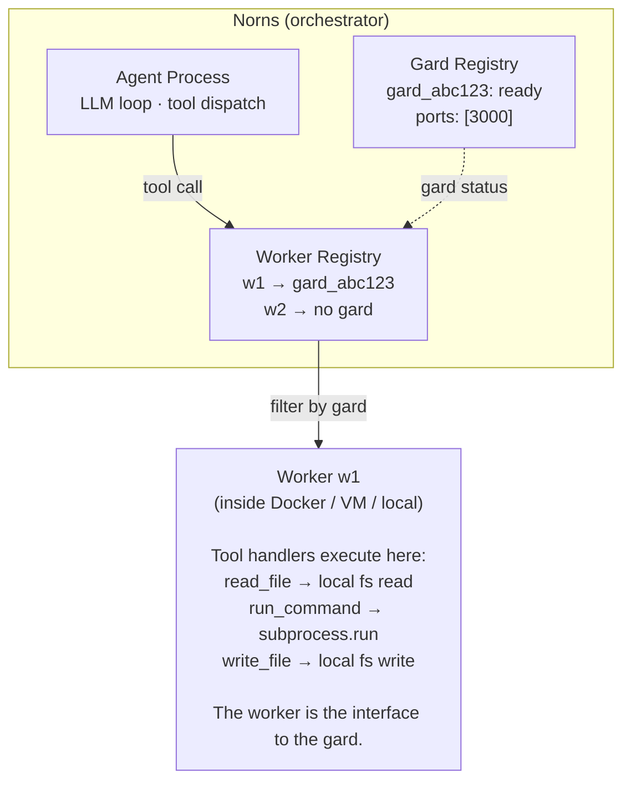

# Norns Gards — Design Document

## Status: v9 — Phase 1 shipped in full 2026-08-10 (registry, claims, strict dispatch, per-run binding, API, `nornsctl gards`, dashboard, Python SDK). Next: Phase 2 provisioner — but note the correction below: connectors run as **no-gard** workers; the first *gard* workload is coding agents. See `decision-log.md` § The provisioner's unit is a deployment

> **Correction (2026-08-14): connectors don't use gards.** Earlier drafts
> said the provisioner's first workload is connectors *in gards*. That can't
> work: dispatch is gard-strict in both directions, so a gard-bound
> connector's tools would be invisible to ordinary (no-gard) runs — the
> exact opposite of a tenant-wide capability layer. Connectors are supervised
> **no-gard** service workers; their tools serve every run. Gards are for
> workloads that need filesystem affinity (coding agents). The provisioner's
> unit is therefore a **deployment** (name + image + secrets + workload
> shape), and a gard is something only some deployments have.

## Summary

Norns gains a lightweight **gard registry** that pins tool dispatch to specific workers. Workers optionally declare a gard when they connect. Runs optionally target a gard. When a run targets a gard, all tool calls dispatch only to workers in that gard.

A **gard** (from Old Norse *garðr*, "enclosure") is a bounded execution context — filesystem, processes, network — where a worker operates. Like Midgard (the human world) or Asgard (the gods' realm), each gard is a self-contained domain.

Norns does NOT create, manage, or provision gards. A separate **worker provisioner** (external tool) handles infrastructure — creating containers/VMs, starting workers inside them, setting up tunnels for port exposure. Norns just tracks which gards exist and routes tool calls accordingly.

This keeps Norns as a pure orchestrator. All infrastructure complexity lives outside Norns.

---

## The Problem

A coding agent needs all its filesystem-touching tool calls to go to the same worker. Today, `WorkerRegistry.find_worker` grabs the first matching worker for a tool name. If two workers both register `read_file`, a file written through Worker A might be read through Worker B — which doesn't have that file.

Coding tasks need **worker affinity**: all tool calls in a run go to the same worker, operating on the same filesystem.

---

## Architecture

### What Norns Does

```
Gard Registry:
  - Stores gard records (id, name, status, ports)
  - Workers claim a gard when they register
  - Runs target a gard
  - Tool dispatch filters by gard
  - Port URLs recorded and shown in dashboard

That's it.
```

### What Norns Does NOT Do

```
  - Create containers or VMs
  - Install software
  - Manage filesystems
  - Proxy network traffic
  - Execute commands inside gards
  - Snapshot or restore anything
```

### What the Provisioner Does (Separate Tool)

```
  - Creates infrastructure (Docker containers, VMs, bare directories)
  - Calls Norns API to register a gard
  - Injects secrets into the gard as env vars (worker credentials:
    Slack tokens, DB creds, LLM keys — never stored in Norns)
  - Starts a worker inside the gard
  - Worker connects to Norns, claims the gard
  - Sets up tunnels for port exposure (remote case)
  - Handles code extraction when done (git push, file copy)
  - Handles snapshots if supported by the provider
```

### The Flow

```
1. Provisioner → Norns:  POST /api/gards {name: "my-project"}
                         ← {id: "gard_abc123", status: "pending",
                            claim_token: "tok_xyz789"}

2. Provisioner creates infrastructure (Docker, VM, directory, whatever)

3. Provisioner starts worker inside the gard, passing the claim token
   Worker connects to Norns via WebSocket:
   {worker_id: "w1", tools: [...],
    gard: "gard_abc123", claim_token: "tok_xyz789"}

4. Norns validates claim token, matches worker to gard
   gard_abc123: status "pending" → "ready"

5. User sends a message to the agent, optionally targeting a gard
   Registry.send_message(tenant_id, agent_id, content,
     gard_id: "gard_abc123")

6. Agent calls read_file → dispatched ONLY to workers in gard_abc123
   Agent calls write_file → dispatched ONLY to workers in gard_abc123
   Agent calls run_command → dispatched ONLY to workers in gard_abc123
   Consistency guaranteed.

7. Worker executes tools directly — it's already inside the gard
   No RPC back to Norns. No env.exec(). Just subprocess.run().
```



---

## Two Deployment Cases

### Case 1: Local Development

```
User is on their Mac. Norns is running locally. No isolation needed.

$ nornsctl gard create --name my-project
→ gard_abc123 created (status: pending, claim_token: tok_xyz789)

Worker is a Python process started manually or by a simple script.
Reads/writes files in ~/projects/my-project directly.

$ cd ~/projects/my-project
$ norns-coding-agent --gard gard_abc123 --claim-token tok_xyz789 \
    --norns-url http://localhost:4000

Worker connects, claims gard_abc123 with valid token. Status → ready.
Agent runs. Tools execute directly on local filesystem.
npm start runs on the user's machine. Port 3000 is already accessible.

No Docker. No proxy. No tunnels.
When done, the code is already on the local filesystem.
```

**Complexity: Near zero.** A gard is a label + dispatch filter.

### Case 2: Remote / Sandboxed

```
Workers are in the cloud. Isolation is needed.

$ nornsctl gard create --name my-project --template node-20
→ gard_abc123 created (status: pending, claim_token: tok_xyz789)

Provisioner (separate tool) handles the rest:
  1. Creates a Docker container (or VM) from node-20 template
  2. Copies/clones project files into it
  3. Starts norns-coding-agent worker inside the container
     passing --gard gard_abc123 --claim-token tok_xyz789
     Note: Norns URL must be reachable from the container.
     For Docker on macOS, use host.docker.internal:4000.
  4. Worker connects to Norns, claims gard_abc123. Status → ready.
  5. Sets up tunnel (Cloudflare Tunnel, ngrok, bore, etc.)

Agent runs. Tools execute inside the container.
npm start runs inside the container on port 3000.

Port exposure via tunnel:
  Worker tells Norns about the port:
    norns.register_port(internal_port=3000, name="react",
                        url="https://abc123-3000.tunnel.dev")
  Norns records it. Dashboard shows the link.
  Norns doesn't proxy anything.

Code extraction when done:
  - git push from inside container (preferred)
  - volund export gard_abc123 ./local-dir
  - or just keep the container alive for inspection
```

**Complexity: In the provisioner and tunneling.** Norns itself is still just a registry and dispatch filter.

### Where Complexity Lives

```
Feature                    Norns        Provisioner     Notes
─────────────────────────────────────────────────────────────────
Gard registry              small        —               new table + API
Worker affinity/dispatch   small        —               filter in find_worker
Port URL registration      trivial      —               store URLs, validate scheme
Dashboard                  small        —               new LiveView page
Container/VM management    —            medium          Docker/Firecracker
Tunnel setup               —            medium          ngrok/cloudflare/bore
Code extraction            —            small           git push / cp
Snapshot/restore           —            medium          provider-specific
Template management        —            small           Docker images
```

Norns changes are small and well-contained. The provisioner is where the hard infrastructure problems live, and it's a separate tool.

---

## Detailed Design

### Gard Binding: Per-Run

A gard is bound **per-run**, not per-agent-process. This is marginally more code than per-process binding, but it lets an agent be re-pointed at a fresh gard without restarting its GenServer — useful when a gard is destroyed and rebuilt.

Today, `Registry.send_message/3` creates a run via `Process.send_message/2`. This grows an optional `gard_id`:

```elixir
# Norns.Agents.Registry
def send_message(tenant_id, agent_id, content, opts \\ []) do
  gard_id = Keyword.get(opts, :gard_id)
  # ... find or start agent process ...
  Process.send_message(pid, content, gard_id: gard_id)
end
```

The agent process stores the current run's `gard_id` in state and passes it through to every `WorkerRegistry.dispatch_task` call:

```elixir
# In process.ex handle_call({:send_message, ...})
def handle_call({:send_message, content, opts}, _from, %{status: :idle} = state) do
  gard_id = Keyword.get(opts, :gard_id)

  {:ok, run} = Runs.create_run(%{
    # ... existing fields ...
    gard_id: gard_id
  })

  state = %{state |
    run: run,
    gard_id: gard_id,  # stored for dispatch
    # ... rest unchanged
  }
  # ...
end
```

The `AgentChannel` and HTTP run-creation API pass it through:

```elixir
# agent_channel.ex
def handle_in("send_message", %{"content" => content} = params, socket) do
  gard_id = Map.get(params, "gard_id")
  case Registry.send_message(tenant_id, agent_id, content,
         gard_id: gard_id) do
    # ...
  end
end
```

### Dispatch Filter: Strict Equality

The dispatch filter uses **strict equality**, not a permissive fallback:

```elixir
# In find_worker — both sides can be nil
fn w ->
  Process.alive?(w.channel_pid) and
  Enum.any?(w.tools, &(tool_name(&1) == tool_name)) and
  w.gard == gard    # strict: nil == nil, "abc" == "abc"
end
```

This means:
- No-gard runs dispatch **only** to no-gard workers.
- Gard-bound runs dispatch **only** to workers in that exact gard.
- A gard-bound worker **never** serves no-gard runs (preventing filesystem state leakage).
- A no-gard run **never** grabs a gard-bound worker (preventing stolen dispatch).

**Note on `:default` tenant fallback:** `find_worker` (line ~313) falls back to `:default` tenant workers when no tenant-specific match is found. Default-tenant workers have no gard, so the fallback only fires when `gard == nil`. This is correct: gard-bound runs should never fall back to a generic default worker. Comment this in the code.

**Note on LLM dispatch:** `dispatch_llm_task` does NOT gain a gard filter. LLM workers have nothing to do with filesystem affinity. They process inference requests, not tool calls. Do not "complete the symmetry" — it would break LLM dispatch for gard-bound runs when the LLM worker (correctly) has no gard.

### Worker-Per-Gard Cardinality: Exactly One

Each gard has at most one active worker. If a second worker tries to claim an already-claimed gard, the claim is rejected:

```elixir
defmodule Norns.Gards do
  import Ecto.Query

  def claim(tenant_id, gard_id, claim_token) do
    # Atomic conditional update — prevents TOCTOU race when two workers
    # connect simultaneously. Only one wins; the other gets a classified error.
    query =
      from g in Gard,
        where: g.id == ^gard_id and g.tenant_id == ^tenant_id and
               g.claim_token == ^claim_token and
               g.status in ["pending", "disconnected"]

    case Repo.update_all(query, set: [status: "ready", updated_at: DateTime.utc_now()]) do
      {1, _} -> :ok
      {0, _} -> classify_claim_failure(tenant_id, gard_id, claim_token)
    end
  end

  defp classify_claim_failure(tenant_id, gard_id, claim_token) do
    case Repo.get_by(Gard, id: gard_id, tenant_id: tenant_id) do
      nil                                    -> {:error, :not_found}
      %{status: "destroyed"}                  -> {:error, :gard_destroyed}
      %{status: "ready"}                      -> {:error, :already_claimed}
      %{claim_token: ^claim_token}            -> {:error, :already_claimed}  # race lost
      _                                       -> {:error, :invalid_claim_token}
    end
  end

  def mark_disconnected(tenant_id, gard_id) do
    # Idempotent — safe to call multiple times on same disconnect.
    # Only transitions ready → disconnected. Does not write if already disconnected.
    query =
      from g in Gard,
        where: g.id == ^gard_id and g.tenant_id == ^tenant_id and
               g.status == "ready"

    Repo.update_all(query, set: [status: "disconnected", updated_at: DateTime.utc_now()])
    :ok
  end
end
```

Status transition table:

| Current Status | Claim Result | New Status | Notes |
|---------------|-------------|-----------|-------|
| `pending` | ✅ success | `ready` | First worker connects |
| `ready` | ❌ `:already_claimed` | unchanged | Prevents two workers in one gard |
| `disconnected` | ✅ success | `ready` | Worker reconnect (any worker with valid token) |
| `destroyed` | ❌ `:gard_destroyed` | unchanged | Gard is gone |

When a worker disconnects, the gard transitions to `disconnected`, not `destroyed`. This allows reconnection. Explicit `DELETE /api/gards/:id` transitions to `destroyed`.

### Gard Destruction Semantics

`DELETE /api/gards/:id` is not just a status flip. It must clean up connected workers and in-flight runs:

1. Transition status → `destroyed`.
2. Close the WebSocket of any worker currently claiming this gard. This triggers the existing `unregister`/DOWN path in `WorkerRegistry` (`kick_gard_workers/2`).

   **Known gap (2026-09-22):** that path now re-dispatches the tool calls those workers held rather than failing them (`decision-log.md` § A lost tool call is re-dispatched). Dispatch is gard-strict, and the gard is destroyed, so no worker can ever take them: the task queues and the run stalls until the agent's five-minute task timeout. A destroyed gard should fail its in-flight tasks outright — the run cannot continue without the checkout it was bound to — so the kick needs to be distinguishable from a worker simply dying.
3. Cascade-delete ports.

Optionally, reject `DELETE` if the gard has an active run (status `running` in the `runs` table) unless `force: true` is passed. If forced, the run fails with a clear error: "gard destroyed mid-run."

```elixir
def destroy(tenant_id, gard_id, opts \\ []) do
  force = Keyword.get(opts, :force, false)

  if not force and has_active_run?(gard_id) do
    {:error, :active_run}
  else
    # Atomic status transition
    query =
      from g in Gard,
        where: g.id == ^gard_id and g.tenant_id == ^tenant_id and
               g.status != "destroyed"

    case Repo.update_all(query, set: [status: "destroyed", updated_at: DateTime.utc_now()]) do
      {1, _} ->
        # Kick the connected worker (triggers disconnect cascade)
        kick_worker_for_gard(tenant_id, gard_id)
        :ok
      {0, _} ->
        {:error, :not_found_or_already_destroyed}
    end
  end
end
```

### Built-in Tools and Child Agents

Built-in tools (`wait`, `launch_agent`, `list_agents`) are intercepted in `process.ex` before hitting `WorkerRegistry.dispatch_task`. They bypass the gard filter. This is correct.

**Child agent gard inheritance:** When `launch_agent` creates a child agent, the child inherits the parent's gard unless the `launch_agent` arguments explicitly specify a different one. This ensures a child agent working on the same coding task operates on the same filesystem:

```elixir
# In resolve_launch_agents, when creating child:
child_gard = get_in(block, ["arguments", "gard_id"]) || state.gard_id

Registry.send_message(st.tenant_id, child_agent.id, message,
  conversation_key: conversation_key,
  gard_id: child_gard
)
```

### Conversation-Gard Staleness

**Known sharp edge:** Agent conversations persist across runs (`conversations` table). Run 1 in `gard_A` produces tool results referencing files in `gard_A`. If run 2 targets `gard_B`, the agent's history references a filesystem that no longer applies.

**v1 mitigation:** Document as a known limitation. Recommend tying `conversation_key` to gard ID when using gards:

```elixir
# Start agent with gard-scoped conversation
Registry.send_message(tenant_id, agent_id, content,
  gard_id: "gard_abc123",
  conversation_key: "gard_abc123"  # ties conversation to this gard
)
```

This ensures each gard gets its own conversation history. A new gard starts with a clean conversation.

**Long-term fix (not v1):** Per-conversation gard binding, enforced by the system.

---

## Database Schema

```elixir
create table(:gards) do
  add :name, :string
  add :tenant_id, references(:tenants), null: false
  add :status, :string, default: "pending"    # pending, ready, disconnected, destroyed
  add :template, :string                      # informational, not used by Norns
  add :claim_token, :string                   # required for worker to claim this gard
  add :metadata, :map, default: %{}           # provisioner can store whatever it needs
  timestamps()
end

create index(:gards, [:tenant_id])
create index(:gards, [:tenant_id, :status])

create table(:gard_ports) do
  add :gard_id, references(:gards, on_delete: :delete_all), null: false
  add :internal_port, :integer, null: false
  add :url, :string                           # external access URL (tunnel URL, localhost, etc.)
  add :name, :string                          # "react-dev", "api", "postgres"
  add :protocol, :string, default: "http"     # http, https, tcp
  timestamps()
end

# Run gains optional gard association
# Soft-delete only: gards transition to "destroyed" status,
# they are never hard-deleted. FK stays valid.
alter table(:runs) do
  add :gard_id, references(:gards), null: true
end
```

**Port URL validation:** On registration, validate URL scheme is one of `http`, `https`, `tcp`. Reject all others (prevents XSS via `javascript:` URLs rendered in dashboard).

**Port ownership:** Ports belong to the gard, not the worker. They persist across worker disconnects/reconnects. A Docker container restart doesn't drop URLs the user is viewing. Ports are cleaned up only when the gard transitions to `destroyed`.

**Soft-delete only:** Gards are never hard-deleted from the database. `DELETE /api/gards/:id` transitions status to `destroyed` and cascades port deletion. The `gards` row remains for referential integrity with `runs`.

**Claim token entropy:** Generated via `:crypto.strong_rand_bytes(32) |> Base.url_encode64(padding: false)` (256 bits). Do not allow user-supplied tokens.

---

## Changes to Existing Code

### `worker_channel.ex`

Accept optional `gard` and `claim_token` on join:

```elixir
def join("worker:lobby", params, socket) do
  with :ok <- validate_registration(params),
       {:ok, capabilities} <- parse_capabilities(Map.get(params, "capabilities")),
       tenant_id <- socket.assigns.tenant_id do

    gard_id = Map.get(params, "gard")
    claim_token = Map.get(params, "claim_token")

    if gard_id do
      case Gards.claim(tenant_id, gard_id, claim_token) do
        :ok -> :ok
        {:error, reason} -> {:error, %{reason: to_string(reason)}}
      end
    end

    :ok = WorkerRegistry.register_worker(
      tenant_id, params["worker_id"], self(), params["tools"],
      capabilities: capabilities,
      gard: gard_id
    )

    socket = socket
      |> assign(:worker_id, params["worker_id"])
      |> assign(:gard, gard_id)

    {:ok, socket}
  end
end
```

### `worker_registry.ex`

Worker state gains `gard` field:

```elixir
worker = %{
  channel_pid: channel_pid,
  tools: tools,
  capabilities: capabilities,
  monitor_ref: ref,
  tenant_id: tenant_id,
  gard: gard_id                  # NEW — nil if no gard
}
```

`dispatch_task` accepts and applies gard filter:

```elixir
def handle_call({:dispatch, tenant_id, tool_name, input, opts}, _from, state) do
  gard = Keyword.get(opts, :gard)

  worker = find_worker(state, tenant_id, fn w ->
    Process.alive?(w.channel_pid) and
    Enum.any?(w.tools, &(tool_name(&1) == tool_name)) and
    w.gard == gard   # strict equality: nil==nil, "a"=="a"
  end)
  # ... rest unchanged
end
```

**Note:** `dispatch_llm_task` is NOT modified. LLM dispatch has no filesystem affinity.

**`available_tools` gains optional gard filter.** `process.ex:151` calls `available_tools(tenant_id)` to build the tool list advertised to the LLM. Without filtering, gard-bound runs see tools from workers in *other* gards — the LLM tries to call them, dispatch fails, agent gets noisy errors. Add:

```elixir
def available_tools(tenant_id, opts \\ []) do
  gard = Keyword.get(opts, :gard)

  state.workers
  |> Enum.filter(fn {{tid, _}, w} ->
    tid == tenant_id and w.gard == gard
  end)
  |> Enum.flat_map(fn {_, worker} -> worker.tools end)
  # ... rest unchanged
end
```

And in `process.ex`, when building the tool list for the LLM:

```elixir
worker_tools = WorkerRegistry.available_tools(state.tenant_id, gard: state.gard_id)
```

**`TaskQueue` flush must be gard-aware.** When a worker connects, `worker_registry.ex:96-105` flushes queued tasks to it by tool name only. Without a gard check, a queued gard-bound task can flush to a worker in the wrong gard (or no gard) — breaking the affinity invariant. Fix: TaskQueue keys become `{tenant_id, tool_name, gard_id}`, and flush matches all three:

```elixir
# On worker connect, flush only tasks matching this worker's gard:
tools
|> Enum.map(&tool_name/1)
|> Enum.reduce(state, fn name, acc ->
  tenant_id
  |> TaskQueue.flush(name, gard: worker.gard)  # NEW: gard-aware flush
  |> Enum.reduce(acc, fn task, pending_state ->
    push_to_worker(channel_pid, {:push_tool_task, task_payload(task)})
    put_in(pending_state.pending[task.task_id], %{from_pid: task.from_pid, tenant_id: tenant_id, type: :tool})
  end)
end)
```

On worker disconnect, mark gard as disconnected:

```elixir
# In handle_cast({:unregister, ...}) and handle_info({:DOWN, ...})
# Both paths can fire on the same disconnect. mark_disconnected is idempotent.
if worker.gard do
  Gards.mark_disconnected(tenant_id, worker.gard)
end
```

### `process.ex`

State gains `gard_id` (set per-run):

```elixir
# In handle_call({:send_message, content, opts}, ...)
gard_id = Keyword.get(opts, :gard_id)

state = %{state |
  run: run,
  gard_id: gard_id,
  # ... rest unchanged
}
```

Gard passed through to tool dispatch:

```elixir
# In dispatch_tool_execution, for each regular tool call:
WorkerRegistry.dispatch_task(state.tenant_id, tc["name"], tc["arguments"],
  from_pid: self(),
  agent_id: state.agent_id,
  run_id: state.run.id,
  gard: state.gard_id    # NEW
)
```

Child agents inherit parent gard:

```elixir
# In resolve_launch_agents
child_gard = get_in(block, ["arguments", "gard_id"]) || state.gard_id

Registry.send_message(st.tenant_id, child_agent.id, message,
  conversation_key: conversation_key,
  gard_id: child_gard
)
```

### `agent_channel.ex`

Pass gard through from WebSocket:

```elixir
def handle_in("send_message", %{"content" => content} = params, socket) do
  gard_id = Map.get(params, "gard_id")

  case Registry.send_message(tenant_id, agent_id, content,
         gard_id: gard_id) do
    {:ok, run_id} -> {:reply, {:ok, %{run_id: run_id}}, socket}
    {:error, reason} -> {:reply, {:error, %{reason: inspect(reason)}}, socket}
  end
end
```

### `agent_def.ex`

**No changes.** Gard is a runtime concern, not agent configuration.

### Idempotency

**One change:** Add `gard_id` to the idempotency key. The same `(tool, args)` in two different gards is genuinely two different operations — without the gard in the key, crash recovery could skip a tool call in gard B because gard A already has a result for the same `(tool, args)` combination.

```elixir
# In Norns.Tools.Idempotency
def key(run_id, step, tool_call_id, tool_name, gard_id \\ nil) do
  "run:#{run_id}:step:#{step}:tool:#{tool_call_id}:name:#{tool_name}:gard:#{gard_id}"
end
```

Backwards-compatible: no-gard runs get `nil` in the key position, matching today's behaviour.

---

## API Endpoints

```
POST   /api/gards                           create (returns id + claim_token)
GET    /api/gards                           list (filtered by tenant)
GET    /api/gards/:id                       inspect (includes ports, status)
DELETE /api/gards/:id                       soft-destroy (status → destroyed)
PATCH  /api/gards/:id                       update metadata

POST   /api/gards/:id/ports                 register a port (validates URL scheme)
GET    /api/gards/:id/ports                 list ports
DELETE /api/gards/:id/ports/:port_id        remove a port

POST   /api/runs                            (extended: accepts gard_id)
```

### Port Registration Validation

```elixir
def register_port(gard_id, params) do
  url = params["url"]

  if url do
    uri = URI.parse(url)
    unless uri.scheme in ["http", "https", "tcp"] do
      {:error, :invalid_url_scheme}
    end
  end

  # ... create port record
end
```

### Port Registration Transport

`register_port` is sent as a WebSocket push on the existing worker channel, not a separate HTTP call. This reuses the worker's authentication and avoids a second connection:

```elixir
# worker_channel.ex
def handle_in("register_port", %{"internal_port" => port} = params, socket) do
  gard_id = socket.assigns.gard
  if gard_id do
    case Gards.register_port(gard_id, params) do
      {:ok, port_record} -> {:reply, {:ok, port_record}, socket}
      {:error, reason} -> {:reply, {:error, %{reason: to_string(reason)}}, socket}
    end
  else
    {:reply, {:error, %{reason: "no gard"}}, socket}
  end
end
```

The Python SDK infers the gard from connection state and sends the channel push.

---

## CLI

Extend `nornsctl`:

```
nornsctl gard create [--name N] [--template T]
nornsctl gard destroy GARD_ID
nornsctl gard list
nornsctl gard inspect GARD_ID
nornsctl gard ports GARD_ID
```

---

## Dashboard

New LiveView page at `/gards`:

```
┌──────────────────────────────────────────────────────────┐
│ Norns > Gards                                            │
├──────────────────────────────────────────────────────────┤
│                                                          │
│ 🟢 my-project (gard_abc123)                             │
│    Worker: coding-worker-1                               │
│    Template: node-20                                     │
│    Ports:                                                │
│      :3000 → http://localhost:3000        [Open]         │
│      :8000 → https://abc-8000.tunnel.dev  [Open]         │
│                                                          │
│ 🟡 experiment (gard_def456)  — waiting for worker        │
│    Template: python-311                                   │
│                                                          │
│ 🔴 old-project (gard_ghi789) — worker disconnected      │
│                                                          │
└──────────────────────────────────────────────────────────┘
```

All port URLs rendered as links. URL scheme validated on registration (http/https/tcp only) to prevent XSS.

---

## Worker SDK Changes

### Python SDK

Workers that want gard support pass it at registration. Tools execute locally — no RPC layer.

```python
from norns import Norns

norns = Norns(url="http://localhost:4000")
norns.register_worker(
    worker_id="coding-worker-1",
    tools=[read_file, write_file, run_command, start_service],
    gard="gard_abc123",
    claim_token="tok_xyz789"
)

# Tools execute locally. Worker is inside the gard.
@tool
def read_file(path: str) -> str:
    """Read a file from the workspace."""
    with open(os.path.join(WORKSPACE, path)) as f:
        return f.read()

@tool
def run_command(command: str) -> str:
    """Run a shell command."""
    result = subprocess.run(command, shell=True, cwd=WORKSPACE,
                          capture_output=True, text=True, timeout=30)
    return f"Exit {result.returncode}:\n{result.stdout}\n{result.stderr}"

@tool
def start_service(command: str, port: int, name: str = "") -> str:
    """Start a long-running service."""
    subprocess.Popen(command, shell=True, cwd=WORKSPACE)
    # SDK infers gard from connection state — no need to pass it
    norns.register_port(internal_port=port, name=name,
                        url=f"http://localhost:{port}")
    return f"Service '{name}' started on port {port}"
```

**Note:** `register_port` infers the gard from the worker's connection state. The worker declared its gard at registration; there's no reason to re-specify it on every port call. This removes a class of mismatch errors.

---

## Port Exposure

### Local Case

Ports are already on localhost. Worker registers them with Norns for visibility:

```python
norns.register_port(internal_port=3000, name="react",
                    url="http://localhost:3000")
```

### Remote Case

Provisioner or worker sets up a tunnel and registers the tunnel URL:

```python
norns.register_port(internal_port=3000, name="react",
                    url="https://abc-3000.tunnel.dev")
```

Norns doesn't proxy. It stores URLs and shows them in the dashboard.

---

## Provisioner (Separate Tool)

The provisioner is NOT part of Norns. It's a separate CLI/service —
**volund**, a proprietary cloud product (decided 2026-08-14). This section
documents the *contract* any provisioner programs against; the interface is
open even though volund is not, and the templates' Dockerfile plus
`docker run --restart unless-stopped --env-file .env` is the documented
self-host path. Its unit is a **deployment** — name + image + secrets + workload shape. A gard is
optional per-deployment: connector deployments have none (their tools must
be tenant-wide); coding-agent deployments get one (they need filesystem
affinity). Responsibilities 1, 6, and 7 below apply only to gard-bearing
deployments.

### Responsibilities

1. **Create gard record** (gard workloads only) — `POST /api/gards`, receives `id` + `claim_token`
2. **Create infrastructure** — Docker container, VM, or local directory
3. **Inject secrets** — worker credentials (Slack tokens, DB creds, LLM keys) as env vars into the gard. Norns never stores them; the human supplies them to the provisioner. Required by the agent-builder flow (`plan-agent-builder.md`), so the Phase 1 schema must not preclude it.
4. **Start worker** — passes `gard_id` and `claim_token`, worker connects to Norns
5. **Keep it running** — supervise the worker: restart on crash, reconnect on network loss. For long-lived connector workers this is the core value, not an afterthought.
6. **Set up port exposure** — tunnels for remote, direct for local (coding-agent workload only)
7. **Handle code extraction** — git push, file copy, artifact upload (coding-agent workload only)
8. **Handle teardown** — stop worker, destroy infra, `DELETE /api/gards`

### Network Note

When both Norns and the worker are in Docker containers on macOS, the worker's `localhost:4000` is the container itself, not the host. The provisioner must inject the correct Norns URL. For Docker on macOS, this is `host.docker.internal:4000`.

### Example CLI

```bash
# P0 — connector deployment (no gard): build or pull, inject secrets, supervise
$ volund up slack --build ./my-slack-worker --env-file .env
$ volund up slack --image ghcr.io/nornscode/slack-connector --env-file .env
$ volund list          # joins container state with worker-connected state
$ volund logs slack
$ volund restart slack
$ volund down slack

# P1 — coding-agent deployment (gard): provisioner creates the gard,
# injects GARD_ID + CLAIM_TOKEN, copies the workspace in
$ volund up feature-x --gard --build ./coding-worker \
    --workspace ~/projects/my-app --env-file .env

# Extract code when done
$ volund export feature-x --to ~/projects/my-app
$ volund git-push feature-x --remote origin --branch agent/feature-x
```

---

## Snapshots (Future)

Snapshots are NOT part of Phase 1. When added, they work through the provisioner, not Norns core.

The provisioner knows how to snapshot its infrastructure (docker commit, Firecracker snapshot, filesystem clone). It pushes snapshot metadata to Norns via API. Restoring a snapshot means the provisioner creates new infrastructure from the snapshot and starts a new worker that claims the gard.

Norns' role in snapshots is limited to:
- Storing snapshot metadata (id, name, timestamp, associated checkpoint)
- Pairing gard snapshots with conversation checkpoints
- Providing API for snapshot CRUD

If snapshots are paired with conversation checkpoints, the `checkpoint_saved` event payload gains an optional `gard_snapshot_id` field. One write, no atomicity issue. Orphan GC handled by an Oban job.

---

## Implementation Plan

### Phase 1: Gard Registry + Dispatch Affinity

**Norns changes:**

1. `gards` table (with `claim_token`) + `gard_ports` table (with URL scheme validation)
2. `runs` table gains `gard_id` FK (nullable, soft-delete only on gards)
3. `Norns.Gards` context — CRUD, `claim/3` with status transition table, `mark_disconnected/2`
4. `WorkerRegistry` — workers register with optional `gard` field
5. `WorkerRegistry.find_worker` — strict-equality gard filter (comment the `:default` tenant interaction)
5b. `WorkerRegistry.available_tools` — optional gard filter; `process.ex` passes `gard: state.gard_id`
5c. `TaskQueue` — keys become `{tenant_id, tool_name, gard_id}`; flush matches all three
6. `WorkerChannel` — accept `gard` + `claim_token` on join, call `Gards.claim/3`
6b. `WorkerChannel` — handle `register_port` push (infer gard from socket assigns)
7. `process.ex` — state gains `gard_id` (per-run via opts), passed through to dispatch
8. `process.ex` — child agents inherit parent's gard unless overridden
9. `AgentChannel` / `Registry.send_message` — accept optional `gard_id`
9b. `Norns.Tools.Idempotency` — add `gard_id` to key generation
10. API: gard CRUD + port registration with URL scheme validation
10b. `Gards.destroy/3` — atomic status transition + worker kick + active-run guard
11. `nornsctl gard create|destroy|list|inspect|ports`
12. Dashboard: gards LiveView with status, worker info, and port links
12b. `RunLive` — surface `gard_id` on existing run detail view

**SDK changes:**

13. Python SDK: `register_worker` accepts optional `gard` + `claim_token`
14. Python SDK: `register_port` infers gard from connection state

**Backwards compatibility:** Runs without a gard work exactly as today. Workers without a gard work exactly as today. No-gard runs only dispatch to no-gard workers; gard runs only dispatch to matching-gard workers. Zero breaking changes. Existing deployments require no migration beyond the schema addition — gards are fully opt-in.

### Phase 2: Provisioner (Separate Repo — `volund`)

**First target: the connector workload — as no-gard workers (see the
Correction at the top).** A connector (Slack, Discord) needs none of the
hard parts — no snapshots, no tunnels (Socket Mode connects outbound), no
code extraction, and **no gard**: its tools must be tenant-wide, which
gard-strict dispatch forbids. It is "run this container with these env vars,
restart it if it dies": the provisioner's minimum viable form, and it
answers a hosting pain users have before any builder exists. Secrets
injection (responsibility 3) covers the token.

Shape: a thin, stateless Go CLI mirroring nornsctl's layout. Docker's
`--restart unless-stopped` *is* the supervisor — no daemon in the MVP.
Secrets are read from `--env-file` at `up` and baked into container env;
the state file (`~/.volund/state.json`) remembers the env-file
*path*, never values, and nothing secret is ever sent to Norns. A driver
interface (`docker` now; `fly`/`firecracker` later) keeps the managed
service a Phase-3+ product, not a rewrite. *(Decided 2026-09-03: the
control plane is Elixir in the cloud app, with a Fly Machines driver;
volund stays the Go CLI and Docker driver — see `decision-log.md`.)*

- **P0 — connectors:** `up <name> --build ./dir | --image ref --env-file
  .env`, `down`, `list`, `logs`, `restart`. `list` joins "container
  running" with "worker connected" via `GET /api/v1/workers` (prerequisite:
  that endpoint — `WorkerRegistry.connected_workers/1` exists but has no
  REST exposure). Second prerequisite: the Python SDK serial-task fix —
  supervised 24/7 connectors are exactly the workload it bites.
- **P1 — gard workloads:** `up --gard` → `POST /api/v1/gards` → inject
  `GARD_ID`/`CLAIM_TOKEN` env → SDK claims on connect. Adds workspace
  copy-in, code extraction (git push / file copy), port mapping. No tunnels
  yet.
- **P2 — managed:** a control plane in the cloud app driving the same
  contract (Fly Machines first), prebuilt connector images
  (`slack-connector`, …), tunnels, snapshots, billing — the
  managed-connector product.

### Phase 3: Snapshots

1. `gard_snapshots` table in Norns
2. API for snapshot CRUD
3. `checkpoint_saved` payload gains optional `gard_snapshot_id`
4. Provisioner implements snapshot/restore for its provider
5. Paired restore: provisioner restores gard + Norns resumes from checkpoint

### Phase 4: Firecracker Provider (Provisioner Plugin)

1. Firecracker VM management in provisioner
2. Sub-second snapshots, memory restore
3. Linux + KVM only

---

## Design Decisions

| Decision | Choice | Rationale |
|----------|--------|-----------|
| Does Norns manage infrastructure? | No | Norns is an orchestrator. Provisioner handles infra. |
| Does Norns proxy ports? | No | Workers register URLs. Norns stores and displays them. |
| Where do tools execute? | In the worker, locally | Worker is inside the gard. No RPC needed. |
| Gard binding | Per-run | More flexible than per-process. Allows re-pointing without GenServer restart. |
| Dispatch filter | Strict equality | No-gard runs only hit no-gard workers. Prevents state leakage. |
| Worker-per-gard cardinality | Exactly one | Prevents dispatch ambiguity and filesystem divergence. |
| LLM dispatch gard-filtered? | No | LLM workers have no filesystem affinity. |
| Child agent gard | Inherits parent's unless overridden | Same coding task should use same filesystem. |
| Port ownership | Belongs to gard, not worker | Survives worker disconnect/reconnect. |
| Port URL validation | http/https/tcp only | Prevents XSS via dashboard link rendering. |
| Gard deletion | Soft-delete (status → destroyed) | Referential integrity with runs table. |
| Gard claim auth | Claim token from `POST /api/gards` | Prevents another user's worker from claiming your gard. |
| CLI | Extend `nornsctl` | Don't invent new binaries. |
| Conversation staleness | Document as known edge, recommend gard-scoped conversation_key | Full fix is not v1. |
| Gard on AgentDef? | No | Runtime concern, not agent config. |

---

## Concurrency Invariants

Load-bearing correctness properties. Future contributors modifying the dispatch path should verify these still hold:

1. **One worker per ready gard.** `Gards.claim/3` uses an atomic conditional `UPDATE` — only one of N simultaneous claimants wins. No `SELECT`-then-`UPDATE` pattern.
2. **Dispatch is gard-strict.** `find_worker` uses strict equality (`w.gard == gard`). No-gard runs never hit gard-bound workers. Gard-bound runs never hit no-gard workers.
3. **TaskQueue flush is gard-aware.** Queued tasks include gard. Flush matches `{tenant_id, tool_name, gard_id}`. A queued gard-bound task never flushes to the wrong worker.
4. **LLM dispatch is NOT gard-filtered.** `dispatch_llm_task` has no gard parameter. LLM workers have no filesystem affinity. Do not add symmetry.
5. **`available_tools` is gard-filtered.** The tool list advertised to the LLM only includes tools reachable in the run's gard. Prevents the LLM from calling tools that dispatch would reject.
6. **Idempotency keys include gard.** The same `(tool, args)` in different gards produces different keys. Crash recovery cannot skip a tool call by matching a result from a different gard.
7. **`mark_disconnected` is idempotent.** Both `unregister` and `DOWN` can fire on the same disconnect. Uses conditional `UPDATE` (only transitions `ready` → `disconnected`).
8. **Port URL scheme is validated.** Only `http`, `https`, `tcp` accepted. Prevents XSS via dashboard rendering.
9. **Claim tokens are 256-bit random.** Generated server-side. Never user-supplied.

---

## Known Limitations (v1)

1. **Conversation-gard staleness.** Conversation history may reference files from a different gard. Mitigate by using `conversation_key: gard_id`. Full per-conversation gard binding is a future concern.

2. **Single worker per gard.** Cannot have multiple workers operating on the same gard. Revisit only if a concrete use case appears.

3. **No snapshot support.** Gard state is not captured alongside conversation checkpoints. Phase 3 concern.

4. **No port proxying.** Norns stores URLs, doesn't route traffic. Remote gards need external tunneling.

---

## What We're NOT Building

- **Environment provider behaviours in Norns** — removed. Norns doesn't create/manage gards.
- **RPC layer for tool primitives** — removed. Workers execute tools locally.
- **`env.exec()` / `env.read()` SDK abstraction** — removed. Workers use subprocess and filesystem directly.
- **Reverse proxy in Norns** — removed. Tunnel services handle port exposure.
- **Meta-agent / speculative execution** — separate project, builds on top of this.
- **Zig TUI** — separate project, talks to Norns via existing API.
