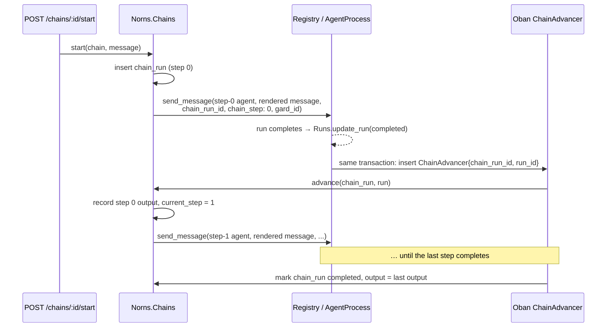

# Plan: Chains

**Status:** Proposed (2026-09-01; `launch_chain` added 2026-09-03)
**Depends on:** per-agent tool selection (shipped), cron triggers (shipped), inbound webhooks (shipped), gards Phase 1 (shipped)
**Relates to:** `plan-agent-builder.md` (compose mode), `plan-custom-agent-workflows.md` (parked)

A **chain** is an ordered list of agent defs that run one after another, each
step's final output becoming the next step's message. It is tenant data, like
a trigger — no repo, no worker code, no LLM deciding what runs next. One chain
run is one case; a fleet is many chain runs of the same chain.

Inspired by Runner's pitch ("break a process you already run into steps and
build a chain of agents with the right tools for each one; run one agent per
customer, thousands under one orchestrator"). Almost everything on that page
is a composition of primitives Norns already has. The chain is the one missing
piece that is small enough to be core.

---

## Why a chain and not a coordinator agent

You can build a chain today: a coordinator def whose only tool is
`launch_agent`, a `SubagentPolicy` allowlist naming the step defs, and a
prompt that says "run these in order and pass the output along". Crash
recovery already reattaches a parent to its in-flight child, so the chain
survives restarts. This is fine for a demo and wrong for a fleet:

- **The sequence lives in a prompt.** Whether step 3 runs after step 2 is an
  LLM decision every time. At thousands of cases, some will skip a step.
- **Every hop costs an LLM turn** whose only job is to call the next tool, and
  the coordinator's context accumulates every step's output.
- **Editing the process means editing prose.** The builder can't safely
  rewrite a coordinator prompt to insert a step; it can insert a row.

The chain makes the sequence data. The steps stay ordinary agents: each is a
def with its own prompt, model, and `ToolPolicy` allowlist — "the right tools
for each step" is per-agent tool selection applied per step. Nothing new
happens *inside* a step. Only the hand-off between steps is new.

---

## Data model

```
chains
  id, tenant_id, name, description
  gard_id          nullable — every step run lands on this gard
  steps            jsonb, ordered:
                     [{ "agent_id": ..., "name": "find-contact",
                        "message": "{{output}}" }, ...]
  enabled

chain_runs
  id, tenant_id, chain_id
  status           pending | running | waiting | completed | failed
  input            text — the message the chain was started with
  output           text — the last step's output, set on completion
  current_step     integer, 0-based
  steps            jsonb snapshot of chain.steps at start time, each entry
                   gaining run_id / status / output as it progresses
  failure_metadata

runs
  + chain_run_id   nullable FK
  + chain_step     nullable integer
```

- `chain_runs.steps` is a **snapshot**. Editing a chain while cases are in
  flight must not change what those cases do; new starts pick up the edit.
- Step runs are ordinary runs with `trigger_type: "chain"`. Started from
  the API, a trigger, or a hook they are top-level: `depth: 0`, no
  `parent_run_id`. Started via `launch_chain` they inherit the parent's
  depth and gard (see below). Sub-agents launched inside a step count depth
  from the step, as they do today.
- `message` on a step is a template. v1 supports two variables:
  `{{input}}` (the chain's original message) and `{{output}}` (the previous
  step's `run.output`). Default `"{{output}}"`; step 0 defaults to
  `"{{input}}"`. Named access to earlier steps
  (`{{steps.find-contact.output}}`) is a later addition if a real chain needs
  it — the parked workflows plan is where anything richer than a template
  belongs.
- Each step run starts a fresh conversation (task mode). Per-case persistent
  history (so a follow-up lands on the same agent that sent the notice) needs
  structured input to derive a key from; deferred, see Open questions.

---

## Execution: no new process, advance on completion

The orchestrator stays pure: a chain is advanced by the same mechanism that
fires triggers — an Oban job — not by a long-lived chain process.



**The hand-off is transactional.** When a run with a `chain_run_id` reaches
`completed` or `failed`, the status update and the `ChainAdvancer` insert
happen in one `Repo.transaction`. Oban's uniqueness on
`{chain_run_id, run_id}` makes a retried advance a no-op. There is no window
where a step finished but nothing will advance the chain, and no chain
process to resume after a crash — `ResumeAgents` already resumes the step
run, and the step run's completion re-enters the same path.

`AgentProcess` learns exactly one thing: carry `chain_run_id` / `chain_step`
from `send_message` opts onto the run row. The completion hook lives in
`Norns.Runs` (or a `Norns.Chains.on_run_finished/1` called from it), not in
the state machine.

**Human-in-the-loop needs nothing.** A step that calls `ask_human` parks its
run in `:waiting`; the chain run mirrors that status and waits. Runner's
"when a customer disputes, it stops and hands you the case" is a step whose
prompt says to ask when there is a dispute. The reply endpoint resumes the
step, the step completes, the chain advances.

**Failure stops the chain.** A failed step marks the chain run `failed` with
the step index and the run's `failure_metadata`. Retrying the step run
(`nornsctl runs retry`) produces a new run; the retried run carries the same
`chain_run_id` / `chain_step`, so its completion advances the chain from
where it stopped. That falls out of the completion hook for free, which is
the argument for hooking completion rather than launching.

**Gards.** `chains.gard_id`, when set, is passed to every step run, so a
whole case executes on one deployment — the same "the deployment is the
execution context" property gard-strict dispatch established for a single
run.

---

## Surface

REST, same shape as triggers:

| Route | Purpose |
|---|---|
| `GET/POST /api/v1/chains`, `GET/PATCH/DELETE /api/v1/chains/:id` | CRUD |
| `POST /api/v1/chains/:id/start` `{message}` | start one case, returns the chain run |
| `GET /api/v1/chains/:id/runs`, `GET /api/v1/chain_runs/:id` | progress: step statuses, run ids, outputs |

`nornsctl chains list / show / start`, and `nornsctl runs show` prints
"step 2 of 4 in chain *collect-invoice*" with the chain run id when a run
belongs to one.

Dashboard: `RunLive` links a step run to its chain run; a `ChainRunLive`
showing steps as a row of run cards is worth doing once a real chain exists,
not before.

**Triggers and hooks target chains** as a second phase: nullable `chain_id`
on `triggers` and `hooks` with a check constraint that exactly one of
`agent_id` / `chain_id` is set. "Every past-due account gets its own agent"
becomes a webhook from the billing system starting one chain run per
overdue invoice — one row per customer, nothing crossed, because each case
is its own BEAM process tree.

---

## Chains as sub-agents: `launch_chain`

Agents should be able to launch a chain the way they launch a sub-agent.
The chain is authorised as a unit — the tenant vetted the composition when
it wrote the row — so a parent needs the chain on its allowlist, not every
step agent.

**Who configures chains** is the other half of this question, and the
answer is nobody from inside a run. Writing a chain definition is
agent-write, the same category as `create_agent`-as-a-tool, parked in
`roadmap.md` § Not now until a capability model exists. The builder writes
chains, but as the cloud product holding a tenant key and calling the REST
API from its worker — compose mode, not a built-in.

### Launching a stored chain (P2)

A `launch_chain` built-in (or `launch_agent` accepting a chain name —
decide at implementation; one tool with a `chain` argument is simpler for
the LLM) starts a chain run with the parent's run as `parent_run_id`. The
parent parks in `:awaiting_tools` exactly as for a sub-agent, and the
chain's final output returns as the tool result.

- **Policy.** `SubagentPolicy.allowed_agents` gains chain names alongside
  agent names (`allowed_chains`, or one list with a `chain:` prefix). Audit
  events mirror the existing four: `chain_launch_allowed` / `_denied`.
- **Depth and gard.** Step runs inherit the parent's `depth + 1` and the
  parent's `gard_id`, as `launch_agent` does today, so `max_depth` bounds
  the chain and the whole case still lands on one deployment.
- **Recovery.** The tool block stores `child_chain_run_id` the way it
  stores `child_run_id`. On resume the parent reattaches to the chain run
  by id and reads its status — the sub-agent recovery fix applied to a
  chain run.
- **Completion signal.** The parent waits on a chain run id, not a run id.
  The advancer broadcasts chain completion and failure on a topic the
  parent subscribes to (`chain_run:<id>`), carrying `output` or the
  failing step's `failure_metadata`.
- **`chain_runs` gains** `parent_run_id` (nullable) so lineage is
  inspectable from either side.

### Ad hoc chains (later, opt-in)

`launch_chain(steps: ["find-contact", "send-notice", "reconcile"])` with no
stored chain. The snapshot design makes it nearly free: a chain run with
`chain_id: nil` whose steps are written at start. It is "run these agents
in sequence with no LLM turn between them", which beats N `launch_agent`
calls on tokens and on reliability of the sequence.

The policy is stricter, because nobody vetted this composition: **every
step agent must be individually allowlisted** by the parent's
`SubagentPolicy`. Keep it out of P1 and P2. The stable process is the
stored chain; an ad hoc one hands the sequence back to the LLM, which is
the thing chains exist to avoid. Add it when a real agent wants it and the
stored form has proven itself.

---

## What this is not

- **Not a workflow engine.** No branching, no parallel steps, no loops. A
  chain is the linear subset expressible as a list. Anything conditional is
  either an agent decision inside a step or the parked
  `plan-custom-agent-workflows.md`, which puts the loop in the worker's
  hands. Chains should stay simple enough that the builder can emit one from
  a process description without reasoning about control flow.
- **Not the playbook compiler.** Turning "collect overdue invoices" into
  three step defs plus a chain is builder work (cloud, `plan-agent-builder.md`
  compose mode). Core ships the chain as a primitive; the chain is pure data,
  so the builder composes it exactly like a def.
- **Not the learning loop.** Runner's "fold what each agent learns back into
  the playbook" needs an agent that edits other agents' defs and a notion of
  run outcome to learn from. Neither exists; both are new surface, and the
  second only becomes real with a fleet running. Out of scope here.

---

## Phases

1. **Core:** tables, `Norns.Chains` context, template rendering, transactional
   advance, `chain_run_id` on runs, REST CRUD + start, `nornsctl chains`.
   Test: a three-step chain where step 2 calls `ask_human`; kill the node
   mid-step-2; reply; assert the chain completes with step 3's output and
   exactly one run per step.
2. **Ingress:** triggers and hooks can target a chain; `trigger_type` on the
   chain run records `schedule` / `webhook` / `api`. **`launch_chain`** for
   stored chains: policy, depth/gard inheritance, reattach, completion
   broadcast (`trigger_type: "subagent"`).
3. **Observability:** `ChainRunLive`; chain membership in `RunLive`.
4. **Ad hoc chains**, opt-in, only when a real agent needs one.

---

## Open questions

- **Per-case conversation keys.** Runner's agent-per-customer keeps history
  across the whole case. For a chain that means a `conversation_key`
  template per step, which needs structured input (`{{input.account_id}}`)
  rather than a plain message. Webhooks already have a JSON payload and a
  `conversation_key_path`; the chain could carry the payload as `input` and
  render keys from it. Decide when the first real chain needs it.
- **Output size.** `run.output` is the assistant's final text. Passing a
  long step output verbatim into the next message is fine for a few steps
  and bloats past that. A `max_output` per step, or asking the step's
  prompt to summarise, are both possible; don't decide yet.
- **Sub-agent policy across steps.** A step's `SubagentPolicy` is unchanged.
  Should a chain be allowed to be a step of another chain? Not in v1 — a
  step is an agent def, full stop. A step *agent* may `launch_chain` once
  P2 lands, which gives nesting through the policy model rather than the
  data model.
- **Fork on a chain run.** `plan-coding-agent-runs.md` proposes
  `POST /runs/:id/fork`. Forking a step run forks that run only; the fork
  carries no `chain_run_id`, so its completion does not advance any chain.
  A chain-level fork ("rerun from step 2 with a different step-2 agent")
  is a snapshot edit plus a new chain run and is a natural later addition.
  Both plans use "kill the node mid-step" as the acceptance test; share
  the harness.
