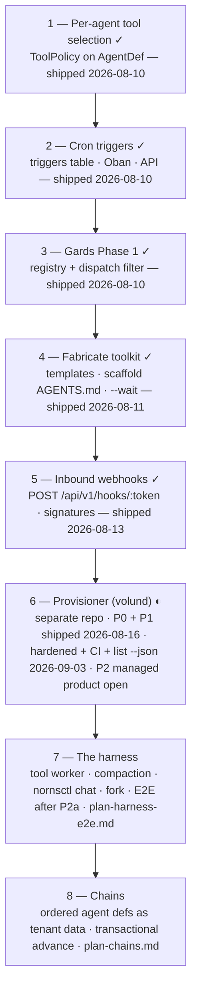

# Norns Roadmap

**Status:** v6
**Last updated:** 2026-09-11 (v6.4: D1–D5 differentiation sequenced after H4, ahead of tenant self-serve — `plan-differentiation.md`)

Sequencing for the next phase of work. For what's already built and why, see
`decision-log.md`. For the product direction this sequence serves, see
`plan-agent-builder.md`. This doc is about what comes next and in what order.

---

## Where we are

The core is shipping: durable agent process, orchestrator/worker split,
provider-neutral LLM format, conversations, REST API + dashboard, multi-agent
orchestration, and both SDKs published (Python at 0.4.0 with gard support
and graceful shutdown, 0.5.0 released 2026-09-09; Elixir 0.2.0 on Hex).
Norns itself is at **v0.6** ("content is opaque", 2026-09-09; v0.5 was
"agents are configuration"). Steps 1–5 below are shipped, and the provisioner (step 6)
has its P0 and P1 landed and hardened, with CI and a machine-readable
status seam in place for P2 — the sequence now adds two things on top of
that foundation: the harness (step 7) and chains (step 8).

The v1 roadmap's "Now" tier is **done**: subagent allowlists shipped
(`SubagentPolicy`), human-in-the-loop is fully wired (`ask_human` /
`:waiting` / `POST /runs/:id/reply`), and sub-agent crash recovery is fixed —
a resumed parent reattaches to its in-flight child instead of relaunching it
(reattach-by-run-id, subscribe-before-read; see `architecture.md`).

## Where we're going

**The agent builder** (`plan-agent-builder.md`): prompt → running, durable
agent. Its central split — **compose** (assemble existing tenant tools into a
new def, pure data, no deploy) vs **fabricate** (generate missing worker code
from a template) — drives the sequence below. Compose is the default mode;
every step here is independently useful even if the builder never ships.

**The v1 fork is decided: own the provisioner.** Fabricated workers need
somewhere durable to run, and that is the provisioner/managed-gards branch.
The coding-agent thread and the builder thread are the same thread. The
durability branch (Durable MCP → custom workflows) stays parked, not dead —
`plan-durable-mcp.md` remains Phase 0 for `plan-custom-agent-workflows.md`
whenever it's picked up.

**The cloud boundary is decided (2026-08-10,** `decision-log.md` **§ The
cloud boundary).** Core (OSS) ships the runtime and the primitives below —
each independently useful, none builder-only. Cloud ships the builder (an
agent running on Norns; it can't live in core without breaking orchestrator
purity), the provisioner, managed gards, and managed connectors. The
provisioner's **first product is managed connectors** — no snapshots, no
tunnels, no code extraction, just supervised containers with injected
secrets — which de-risks the provisioner and hosts the capability layer the
builder later composes against.

---

## The sequence

### 1. Per-agent tool selection — done (2026-08-10)

Shipped as `Norns.Agents.ToolPolicy`: a per-agent allowlist of worker tools
in `model_config["tools"]`, same shape and defaults philosophy as
`SubagentPolicy`. Filters the advertised tool list and rejects out-of-policy
calls at dispatch with a `tool_call_denied` audit event; built-ins exempt.
See `decision-log.md` § Implemented.

### 2. Cron triggers — done (2026-08-10)

Shipped: `triggers` table (agent, cron expression, message, optional
persistent `conversation_key`), fired by a minutely Oban job with an atomic
per-minute claim so a trigger fires at most once per matching minute. Full
CRUD at `/api/v1/triggers` plus `POST /triggers/:id/fire` for testing a
trigger outside its schedule. Runs carry `trigger_type: "schedule"`. Norns is
the system of record — composed agents have no repo for config to live in.
`nornsctl triggers` (list/show/create/update/enable/disable/delete/fire)
shipped in the nornsctl repo the same day.

### 3. Gards Phase 1 — done (2026-08-10)

Registry + dispatch filter, per `gards.md`: `gards`/`gard_ports` tables,
atomic claim tokens, strict-equality dispatch (no-gard runs never touch gard
workers and vice versa), gard-filtered tool advertisement, gard-aware
TaskQueue flush, per-run binding with child inheritance and resume-safe
affinity, gard-scoped idempotency keys, REST CRUD + worker-channel port
registration. The full surface shipped with it: `nornsctl gards`
(create/list/inspect/ports/destroy), the `/gards` dashboard page, and Python
SDK support (`norns.run(agent, gard=, claim_token=)` + `register_port`) —
verified end to end against a live worker. Secrets injection stays a named
provisioner (Phase 2) requirement.

### 4. Fabricate toolkit — done (2026-08-11)

Shipped in the nornsctl repo:

- `nornsctl new --template <name>` — `default` and `slack-bot` (outbound
  `post_to_slack` / `list_slack_channels`; the bot token never leaves the
  worker). The builder writes one tool function, not a system.
- Every scaffold ships `AGENTS.md` teaching any coding agent the full
  build/test/debug loop (scaffold → worker up → test message → read run
  events → iterate). This is the v0 builder.
- `nornsctl agents message --wait` — blocks until the run completes (prints
  output), fails (prints the failure inspector), or parks on a question
  (prints it with the reply command). Verified live.
- Templates ship a Dockerfile + deploy notes as the interim hosting story.

Still open from the template family: a `slack-connector` variant (Socket
Mode inbound listener) — the scaffold's `AGENTS.md` documents the pattern;
build it with the first connector-hosting work.

### 5. Inbound webhooks — done (2026-08-13)

Shipped: `POST /api/v1/hooks/:token` starts a run on the mapped agent with
`trigger_type: "webhook"`. Per-hook server-generated tokens; provider
signature verification (`github`, `stripe`, `slack` — HMAC over the raw
body, constant-time compare, replay-bounded timestamps); optional
`message_path` (e.g. Twilio's `Body`) and `conversation_key_path` (e.g.
`From`, so each sender keeps its own history — verified by test). Unknown
and disabled tokens are indistinguishable; a busy conversation returns 409
so providers retry. Management CRUD at `/api/v1/hooks` + `nornsctl hooks`.
Twilio/Mailgun/GitHub/Stripe are now configuration instead of code.

### 6. Provisioner — `volund` (separate repo)

Phases 2+ of `gards.md`, **connector workload first — as no-gard workers**
(corrected 2026-08-14, `decision-log.md` § The provisioner's unit is a
deployment): gard-strict dispatch means a gard-bound connector's tools would
be invisible to ordinary runs, so connectors are supervised no-gard service
workers and the provisioner's unit is a *deployment* (name + image +
secrets + workload shape), gard optional.

Shape: thin stateless Go CLI, docker driver, Docker restart policy as the
supervisor. Secrets from `--env-file`, baked into container env, never sent
to Norns. **Proprietary** (decided 2026-08-14): volund is the platform's
killer feature — private repo, closed at every phase. The self-host path
stays open and documented (gard API + templates' Dockerfile +
`docker run --restart unless-stopped`); what volund sells is the
operational layer on top.

- **P0 (MVP):** `up`/`down`/`list`/`logs`/`restart`; first real workload is
  the `slack-bot` scaffold run as a supervised connector.
- **P1:** gard workloads — `up --gard` (create gard, inject
  `GARD_ID`/`CLAIM_TOKEN`), workspace copy-in, code extraction, port
  mapping.
- **P1.5 (2026-09-03, shipped):** pre-P2 hardening and the seam the
  control plane consumes. `down` tolerates an already-removed container
  (state and gard still cleaned up); redeploy destroys the previous gard
  instead of orphaning it and warns before discarding `/workspace`;
  containers get a `host.docker.internal` host-gateway alias so injected
  `NORNS_URL` works on the Linux engine, not just Docker Desktop;
  published ports bind to loopback only; `list` matches workers on the
  longest deployment name. New `internal/report` package joins state +
  container + worker into one record, exposed as `list --json` and
  `status <name> [--json]` (shape documented in `volund llms`). First
  tests, and CI on every PR: gofmt/vet/race tests plus a Linux Docker
  smoke test (`up --build`, loopback port, host-gateway reachability,
  `list`, `down` after manual removal).
- **P2:** the managed product — a control plane in the cloud app (Elixir,
  see below) over a Fly Machines driver, prebuilt connector images,
  tunnels, snapshots, billing. Volund itself needs nothing new for P2a.

Two prerequisites in existing repos, both small — **both shipped
2026-08-15**: `GET /api/v1/workers` (live) and the Python SDK serial-task
fix (released as 0.3.1; 0.3.2 added `NORNS_GARD`/`NORNS_GARD_CLAIM_TOKEN`
env fallbacks for P1 gard deployments). Volund P0 shipped against them the
same day; P1 (gard deployments, workspace copy-in/export, port mapping)
landed 2026-08-16, which also forced LLM dispatch to become gard-strict —
see the decision log.

This is the "own the provisioner" commitment — managed deployments as the
home for the tenant's capability layer and, later, builder output.

**P2 shape (decided 2026-09-03,** `decision-log.md` **§ The control plane
is Elixir, in the cloud app).** The control plane is *not* a Go service in
the volund repo. It lives in the private `norns-cloud` Phoenix app — core
as a dependency, plus closed contexts, migrations, and LiveView pages —
one deploy, same Postgres, extra tables. Volund stays the Go CLI: local
dev, self-host operational layer, Docker driver, reference client for the
open contract. Pieces, all Elixir: deployment records (Ecto; the record
takes the shape of volund's `list --json`), a secrets context (Cloak,
KMS key, write-only, decrypted only at machine start — the one stated
exception to "Norns never sees secrets"), an Oban reconciler (desired vs
actual, heals host loss, redeploys, secret rotation), and a Deployments
page in the dashboard. Because the cloud app runs on Fly, the first
driver is **Fly Machines** over Fly's API — no fleet, no host agent.
Calling core contexts in-process means no tenant API key, so key scoping
is off the P2a critical path. Sequence: **P2a** managed connectors
(records, secrets, reconciler, Fly driver, prebuilt images, dashboard
page; customers bring an image, no build service), **P2b** managed gards
(workspace, export, tunnel), **P2c** billing and snapshots. Prerequisites:
SDK graceful shutdown — **shipped 2026-09-09** (core `drain` event; the
Python SDK drains on SIGTERM/SIGINT, released as 0.4.0) — and tenant
self-serve, which remains.

### 7. The harness (`plan-harness-e2e.md`)

A Norns-native coding agent in the shape of pi or amp: a small tool worker
on the developer's machine, `nornsctl chat` to type into, and the loop
running in the orchestrator, where the log already lives. What it has that
no other harness does falls out of where the loop runs: sessions that
survive the laptop, fork from any step, durable sub-agents, runs started
from a cron or a Slack thread. Sequenced ahead of tenant self-serve
(decided 2026-09-09) because it is the demo people can run on their own
repo before the cloud exists, and because a month of using it on norns is
what will harden the edit tool, compaction, and fork. Cost: about three
weeks of delay to tenant self-serve, which nobody external is waiting on.

- **P0 — shipped 2026-09-09:** the opaque-content audit. `Norns.Runtime.Content`,
  the eight fixes, kinded system results, and a conformance suite that
  runs a fully-ciphertext log through validate, replay, resume, and
  complete. Adopted as `decision-log.md` § Content is opaque. Python SDK
  0.5.0 and the Elixir SDK carry the worker side (prompt composition,
  `final_output`, kind rendering, elision).
- **H1 — shipped 2026-09-09:** the `sleipnir` worker: six tools, allow
  list with the `ask_human` approval loop enforced worker-side,
  `AGENTS.md` on start, and a self-configuring CLI (`sleipnir
  allow|config|doctor|docs`) the agent runs through `bash`. Repo:
  github.com/nornscode/sleipnir.
- **H2 — shipped 2026-09-09:** compaction in core (`context_policy`,
  `context_compacted`, summarisation as an LLM task the worker serves;
  `decision-log.md` § Compaction is an LLM task). Needs Python SDK 0.6 /
  Elixir SDK 0.3 on the worker.
- **F — shipped 2026-09-09:** `POST /runs/:id/fork`, `nornsctl runs fork`,
  and "fork from step" on the run page (`decision-log.md` § Fork is a
  checkpoint in a new run).
- **H3 — shipped 2026-09-09:** the session client, as sleipnir itself
  (Python, Textual, the worker in the same process; `decision-log.md`
  § Sleipnir is the tool): every conversation across every gard with
  live status from `GET /api/v1/sessions`, tabs, live events, permissions
  inline, `/fork` and `/resume`. Spaces are gards: one per repository.
- **H4:** a week of dogfooding on norns; the README demo on a real repo.
- **D1–D5 (after H4):** the features no terminal-bound harness can copy —
  answering a parked run from anywhere, runs started by a cron or a webhook
  against a checkout, moving a session between machines, forks as a tree,
  spend and retry-from-failure. `plan-differentiation.md`. D2 is blocked on
  a small gap: triggers and hooks carry no `gard_id`. About two weeks, with
  D1+D2 the first week and a half.
- **E1–E4 (after P2a):** end-to-end encryption — SDK content cipher and
  key file, validator accepts the opaque block, browser-side decrypt in
  the dashboard, Elixir SDK. Waits for P2a so both modes can be shown
  honestly: "end-to-end encrypted" when every worker is tenant-run,
  "encrypted at rest with your key" when the LLM worker runs in the
  cloud. About two weeks.

**Order from here (v6.4):** P0 audit → H1–H4 → D1–D5 → tenant self-serve →
P2a → E1–E4 → Slack connector image → chains phase 1. D1–D5 moved ahead of
tenant self-serve (2026-09-11) for the same reason the harness itself did:
it is what someone can run on their own repo before the cloud exists, and
D1's notifier is the Slack connector's first real consumer.

### 8. Chains (`plan-chains.md`)

An ordered list of agent defs that run one after another, each step's
output becoming the next step's message. Tenant data like a trigger — no
repo, no coordinator prompt, no LLM deciding what runs next. Prompted by
Runner's "break a process into steps, chain agents with the right tools for
each, one agent per customer" — every claim on that page except the
learning loop is a composition of shipped primitives, and the chain is the
one piece missing.

Why it sits here and not under "Alongside": it is the first primitive whose
value is *per case* rather than per agent, which is the shape a fleet has.
And it is what compose mode emits when the process has more than one step —
the builder can insert a row where it could never safely rewrite a
coordinator prompt.

Shape: `chains` + `chain_runs` tables, step runs as ordinary top-level runs
carrying `chain_run_id`, and the advance as an Oban job inserted in the
same transaction that completes a step run. No new process type; the
orchestrator stays pure. HITL and retry fall out of hooking completion —
a step parked on `ask_human` parks the chain, a retried step run advances
it from where it stopped. An optional chain-level gard lands the whole case
on one deployment.

- **P1:** tables, `Norns.Chains`, `{{input}}` / `{{output}}` templates
  (rendered in the LLM worker, not core — `run.output` is content under
  the opaque-content principle in `plan-harness-e2e.md`), transactional
  advance, REST CRUD + `POST /chains/:id/start`,
  `nornsctl chains`. Acceptance: a three-step chain with `ask_human` in
  step 2, node killed mid-step, reply, chain completes with exactly one run
  per step.
- **P2:** triggers and hooks can target a chain (one webhook per overdue
  invoice is one chain run per customer).
- **P3:** chain membership in `RunLive`, a `ChainRunLive`.

Deliberately not a workflow engine — linear only. Branching and parallel
steps stay with the parked `plan-custom-agent-workflows.md`; the playbook
compiler and the learning loop stay with the cloud builder.

---

## Alongside, when convenient

- **Slack connector template/example.** The most demo-able thing Norns could
  have: conversations keyed by thread, `ask_human` relayed into the channel,
  durability visible in a channel people actually use. The outbound half
  shipped as the `slack-bot` template (step 4); the inbound Socket Mode
  listener remains.
- **Blog post** — sub-agent recovery write-up: published as
  ["Is This Still Happening?"](https://mackeracher.com/posts/is-this-still-happening/)
  (2026-08-08).
- **Cross-SDK parity gaps** — Python serial task handling shipped as SDK
  0.3.1 and graceful shutdown as 0.4.0 (2026-09-09); still open:
  per-request LLM keys, model-string separator. Small and independently
  shippable.
- **Template hygiene** — drop the `litellm!=1.96.1` uv constraint from the
  scaffold templates; SDK 0.3.0 carries the exclusion itself.
- **Skírnir** (`skirnir-v0.1-spec.md`) — its runtime blocker (HITL wiring) is
  gone; build whenever the Elixir flagship demo is wanted.
- **Opaque-content audit — done (2026-09-09)** (`plan-harness-e2e.md` P0,
  § What P0 landed). Core no longer reads or writes content anywhere in
  the orchestrator; the conformance suite keeps it that way ahead of
  compaction and chains. Fork (`plan-coding-agent-runs.md` Phase F) moved
  into step 7; the `coding-agent` template (Phase 0) is dropped,
  superseded by the harness.

---

## Cloud readiness

Not sequenced above because none blocks the primitives — but each becomes
real the moment there is a hosted product, and the core API must not paint
itself into a corner on any of them (`decision-log.md` § Cloud readiness):

- **API key scoping** — one bearer token is full tenant power today; a hosted
  builder holding one is the trust problem the introspection toolkit was
  pruned for. Scoped keys are the pre-cloud form of the capability model.
  Not on the P2a path: the control plane calls core in-process
  (2026-09-03).

**Core-as-a-dependency spike — done (2026-09-03).** `norns-cloud` (private
repo) boots with `{:norns, path: "../norns", env: Mix.env()}`: its own
endpoint carries core's sockets and static assets and `forward "/"`s to
`NornsWeb.Router` after cloud routes; core's endpoint runs `server: false`.
One Postgres, two migration dirs (core's first, via `Application.app_dir`
in both the mix alias and the release task). No callable migrations module
was needed. Core changes required: one — an `extra_nav` config hook in the
app layout so cloud pages appear in the dashboard nav. Gotchas: cloud's
`mix.lock` must match core's for shared deps (a newer Oban wanted a schema
migration core doesn't ship); core's `test/support` only exists when the dep
is compiled in the test env. First cloud table: `deployments`, shaped like
volund's `list --json` record, with a Deployments page.
- **Tenant self-serve** — signup → tenant → key issuance. Cloud-repo work;
  sequenced after the harness (step 7) as of v6.3.
- **Retention plan** — cron-triggered agents generate events unboundedly;
  needed before cloud launch, not before growth forces it.
- **SDK hardening** — serial task handling (0.3.1) and graceful shutdown
  (0.4.0, core `drain` event) — both shipped, for connectors that run 24/7.

---

## Not now

Carried forward, deliberately unscheduled:

- **Durable MCP + custom workflows** — parked by the fork decision above.
  Chains (step 7) cover the linear case as data; anything with branching or
  parallelism still needs this.
- **A Norns MCP server** — redundant for CLI clients, insufficient for GUI
  clients; see `plan-agent-builder.md` § Not building.
- **Agent-write tools for agents** (`create_agent` as a tool) — not until a
  capability model exists.
- **Eval primitive / diff_runs / fixture runner** — after the builder loop
  proves itself.
- **Multi-node / Horde clustering.** Registry + DynamicSupervisor are
  single-node (`decision-log.md`).
- **Generic policy-enforcement hook.** Pre-dispatch hook point; architecture
  supports it, not built. Note: `SubagentPolicy` and tool selection are both
  bespoke policy checks — a third one is the signal to build the generic hook.
- **Retention, cleanup, partitioning.** Priority #4 in
  `lessons-absurd-production.md`. Promoted to a cloud-launch prerequisite —
  see Cloud readiness above.
- **Two-phase step API.** Prototype only if a concrete workflow needs it.
- **Fan-out / descendant budget.** `max_depth` bounds recursion, not cost; a
  real spend ceiling is a different mechanism.

---

## Caveat: in-process is a self-host story

The Elixir SDK's sharpest technical claim is the in-process worker — tools
running in the same BEAM VM as the orchestrator, no serialization boundary.
That is what Skírnir exists to demonstrate.

**Managed gards do not deliver it.** A gard is a container or VM; a worker
inside one is co-located, but there is still a serialization boundary. The
in-process advantage is structurally a self-host/embedded property, and the
only hosted form that delivers it is single-tenant dedicated (BEAM process
isolation is a fault boundary, not a security boundary). Marketing should not
promise in-process behaviour that the multi-tenant product cannot deliver.

---

## Related docs

- `decision-log.md` — what's built and why
- `plan-agent-builder.md` — product direction: compose/fabricate, triggers, pruned alternatives
- `gards.md` — worker affinity design (v9; Phase 1 shipped, provisioner phases + the no-gard-connectors correction)
- `plan-chains.md` — ordered agent defs as tenant data (proposed)
- `plan-coding-agent-runs.md` — coding agents as Norns runs: mirror, fork, time travel, prompt experiments (proposed 2026-09-09; fork folded into step 7, Phase 0 dropped, Phase 2 superseded by `plan-harness-e2e.md`, mirroring deferred)
- `plan-differentiation.md` — what sleipnir has that no other harness can, and what not to build (proposed 2026-09-11; D1–D5 after H4)
- `plan-harness-e2e.md` — the Norns-native coding harness and the opaque-content principle that lets the log be end-to-end encrypted (proposed 2026-09-09; step 7 and the audit alongside)
- `plan-subagent-allowlists.md` — agent authorization (Phase 1 shipped)
- `plan-durable-mcp.md` — durable step protocol (parked)
- `plan-custom-agent-workflows.md` — `@agent` + `ctx.*` durable primitives (parked)
- `skirnir-v0.1-spec.md` — Elixir flagship demo
- `lessons-absurd-production.md` — operational priorities
